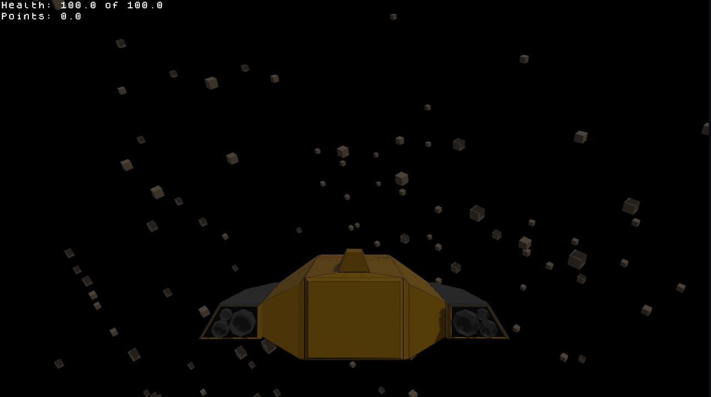

# Stela Nubo
Simple Asteroid Shooter Example Game in Rust wit the Bevy engine

## Controls
- Use W,A,S,D to accelerate and strafe
- Q and E Does a roll
- Spacebar to fly up
- Shift to fly down
- Use mouse to turn
- Left mouse button fires cannon
- Escape to open pause menu

## Goals
- [x] Spawn and despawn objects around the player deterministicly
- [x] Move around the space in a spaceship 
- [x] collide with the objects
- [x] Input System
- [x] Be able to shoot 
- [x] destroy objects
- [x] destruction effect
- [x] player damage
- [x] player death
- [x] Menu
- [x] App Quit
- [x] Game States: Start, Playing, End
- [x] Display Health
- [x] Display Points